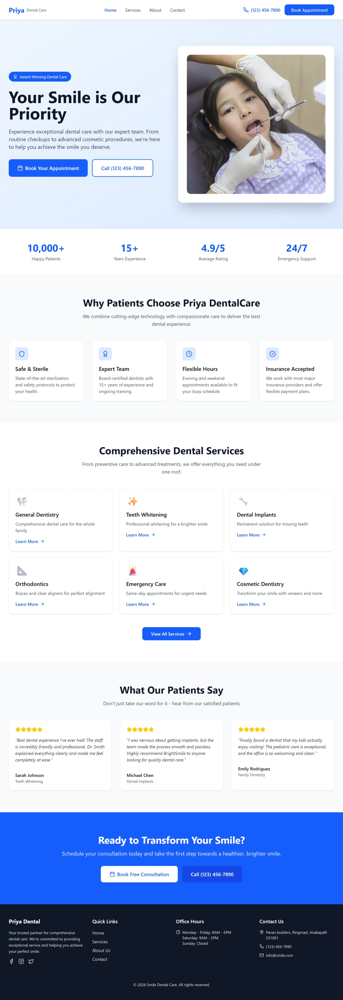
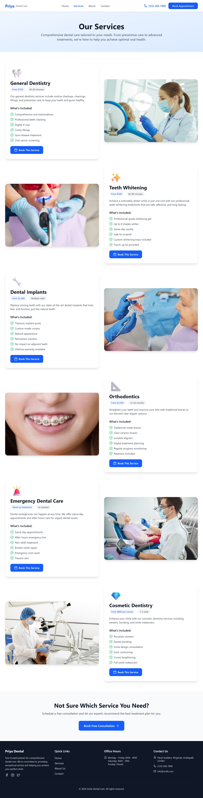
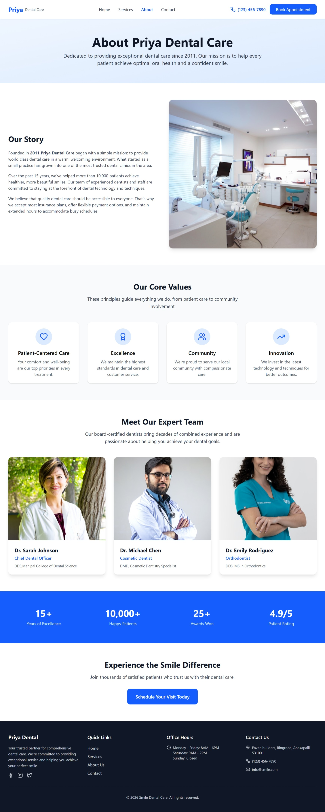
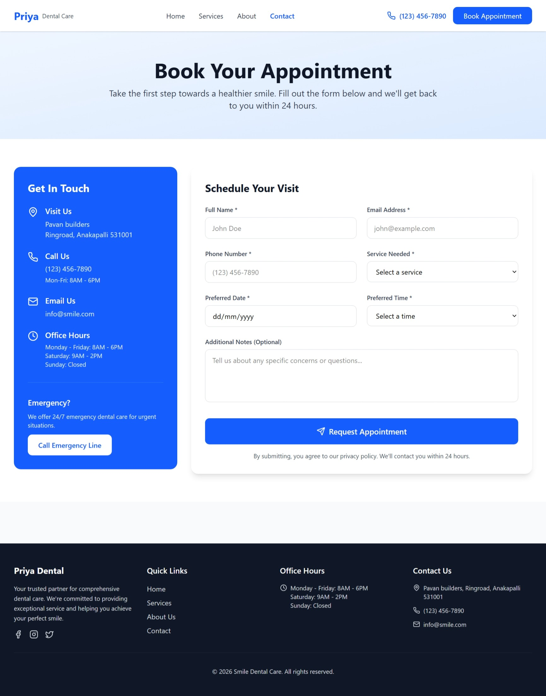

# FUTURE_UX_01
# Priya Dental Care Website UI/UX Design

## 📌 Project Overview
Priya Dental Care Website is a modern and user-friendly dental clinic interface designed with a clean layout and intuitive navigation. The goal of this project was to create a visually appealing experience that helps users easily access services, learn about the clinic, and book appointments.

## Objective
To create a responsive and visually appealing website for a dental clinic.

## ✨ Features
• Responsive and clean user interface  
• Appointment booking section  
• Easy navigation structure  
• Modern visual hierarchy  
• User-friendly design experience  

## 🛠 Tools Used
• Figma 
• UI/UX Design Principles  
• Prototyping  

## 🖥 Desktop Screens

### Homepage

### Services

### About

### Contact

## 🔗 Project Link
Live Website: (https://bask-kindle-31260731.figma.site/)

## Technical Learnings
- Learned visual hierarchy
- Worked with spacing and alignment
- Understood publishing workflow

Created by Padma Priya Tejaswini
